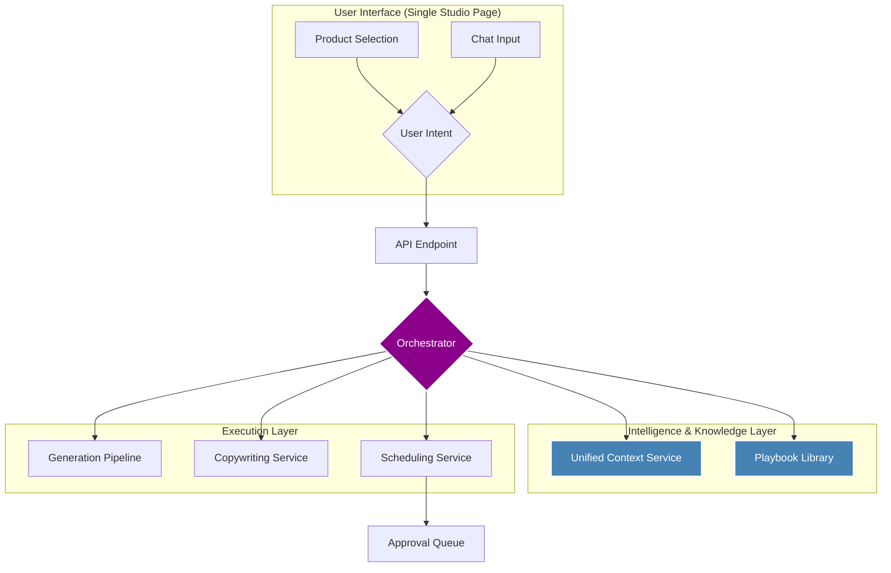

# Project Phoenix: A Proposal to Rebuild the Automated-Ads-Agent

**Author:** Manus AI
**Date:** Mar 07, 2026
**Version:** 1.0

---

## 1. The Vision: A Shared Understanding

Based on our conversations and my deep analysis of the existing 179,227 lines of code, I have synthesized the project's ultimate goal into a single, clear vision:

> To create a **95% autonomous creative partner** that transforms NDS's raw product catalog into a stream of high-performing, brand-aligned social media content, ready for user approval with minimal intervention.

This vision is supported by four foundational pillars that you described:

| Pillar                  | Description                                                                                                                                                                                                                     |
| ----------------------- | ------------------------------------------------------------------------------------------------------------------------------------------------------------------------------------------------------------------------------- |
| **Deep Knowledge**      | The system must possess a complete, multi-faceted understanding of every product, including its specifications, installation methods, and relationships with other products. It must also be an expert on the NDS brand itself. |
| **Smart Intelligence**  | The system must know _what works_. It needs a library of proven, high-performing ad formats ("winning patterns") and a strategic content plan that dictates the right mix of posts over time.                                   |
| **Unified UX**          | The user experience should be a seamless, single-page conversation where the user can select products and chat with their AI partner to iterate on ideas, not navigate between a dozen disconnected tools.                      |
| **Autonomous Workflow** | The system should be capable of running on its own. A user should be able to request a content plan for the next month, and the agent should autonomously generate, schedule, and queue every post for approval.                |

This proposal outlines a concrete, phased plan to realize this vision by restructuring the existing application, connecting its powerful but disconnected services, and building the missing pieces to create a truly intelligent and autonomous system.

---

## 2. Current State Analysis: The Honest Truth

The existing application is a powerful but fragmented collection of services. It contains all the necessary ingredients but lacks the connective tissue to make them work together effectively. Many features are implemented in isolation, resulting in a disconnected user experience and a system that is less than the sum of its parts.

### Feature Implementation Status

| Feature                       | Current Status | Analysis                                                                                                                                                                                                                            |
| ----------------------------- | -------------- | ----------------------------------------------------------------------------------------------------------------------------------------------------------------------------------------------------------------------------------- |
| **Deep Product Knowledge**    | **Partial**    | The `productKnowledgeService` and 48 database tables provide a strong foundation. However, this deep context is not consistently used by the generation services.                                                                   |
| **Winning Pattern Library**   | **Partial**    | The `patternExtractionService` ("Learn from Winners") is a brilliant concept, but its output is not integrated into the main generation pipeline. It's a library of intelligence that is never read.                                |
| **Posting Strategy**          | **Exists**     | The `weeklyPlannerService` and `contentTemplates.ts` define a clear content strategy (e.g., 25% product, 30% educational). This is a solid, well-researched component.                                                              |
| **Agent as Creative Partner** | **Missing**    | The current agent is a simple tool-caller. It can `list_products` or `generate_image`, but it cannot reason strategically or act as a creative partner. The `agentDefinition.ts` prompt is good, but the orchestrator is too basic. |
| **Unified UX**                | **Missing**    | The UI is a collection of 10+ separate pages (`Studio`, `ContentPlanner`, `Library`, `LearnFromWinners`, etc.), forcing the user to navigate a complex web of tools instead of having a single, focused workspace.                  |
| **Autonomous Workflow**       | **Missing**    | The `weeklyPlannerService` can create a plan, but there is no mechanism to automatically execute that plan (i.e., generate all the posts for the week) and send them to the approval queue.                                         |
| **Approval Queue**            | **Exists**     | The `approvalQueueService` and corresponding UI are well-implemented and functional. This is a production-ready component.                                                                                                          |

### Key Findings

- **Strength in Depth:** The project's greatest asset is the depth of its data model and the specialized services that exist for knowledge extraction, content safety, and platform-specific publishing. The foundation is strong.
- **The Disconnect:** The primary weakness is the lack of integration. For example, the `generationPipelineService` is a step in the right direction but does not incorporate the `patternExtractionService` or the `brandDNAService` effectively.
- **Agent is Underpowered:** The agent is currently a simple command executor. It lacks the orchestration logic to perform complex, multi-step tasks like "plan my content for next week."
- **UI is Fragmented:** The user is forced to be the orchestrator, navigating between different pages to perform a single workflow. This contradicts the vision of a unified, conversational experience.

---

## 3. The Phoenix Architecture: A Path Forward

I propose a new architecture that simplifies the system, unifies the user experience, and empowers the agent to become the autonomous creative partner you envisioned. This architecture is built around two core concepts: a **Unified Context** and a **Playbook-Driven Orchestrator**.

### High-Level Architecture

### Core Components

1.  **The Unified Studio UI:** We will merge the `Studio`, `AgentChat`, and `ProductLibrary` into a single, cohesive page. This will be the user's primary workspace, allowing them to select products, chat with the agent, and see results in one place.

2.  **The Playbook-Driven Orchestrator:** This new service will replace the current `agentRunner`. Instead of a simple tool loop, it will execute high-level "playbooks" based on user intent. These playbooks are pre-defined, multi-step workflows that codify the complex tasks you described.
    - **Playbook Example: `Generate_Weekly_Plan`**
      1.  `call:weeklyPlannerService.generateWeeklyPlan()`
      2.  `forEach:plan.posts`
      3.  `call:UnifiedContextService.build({ product, template })`
      4.  `call:generationPipelineService.execute({ context })`
      5.  `call:copywritingService.generate({ context, image })`
      6.  `call:approvalQueueService.submit({ post })`
      7.  `end`

3.  **The Unified Context Service:** This new service will be responsible for gathering all necessary context for a generation task. It will call the `productKnowledgeService`, `brandDNAService`, `patternExtractionService`, and `fileSearchService` and assemble a single, rich context object. This ensures that every generation is informed by the full depth of the system's knowledge and intelligence.

---

## 4. The 4-Phase Implementation Plan

I will deliver this new architecture in four distinct, sequential phases. Each phase will result in a tangible improvement to the system and will be accompanied by a full suite of tests.

### Phase 1: The Unified Knowledge Layer

- **Goal:** Consolidate all context sources into a single, reliable service.
- **Actions:**
  1.  Create the new `UnifiedContextService`.
  2.  Refactor the `generationPipelineService` to use this new service exclusively.
  3.  **Crucially, ensure the `patternExtractionService` (Learn from Winners) is a primary input, feeding proven patterns into every prompt.**
  4.  Strengthen the `brandDNAService` to provide more concrete, actionable rules for the generation process.
- **Outcome:** All AI generations will be significantly smarter and more brand-aligned, as they will be informed by the full breadth of the system's knowledge.

### Phase 2: The Autonomous Orchestrator & Playbooks

- **Goal:** Build the new orchestrator and the core playbooks for autonomous content creation.
- **Actions:**
  1.  Create the new `OrchestratorService`.
  2.  Implement the three core playbooks: `Generate_Single_Post`, `Generate_Campaign`, and `Generate_Weekly_Plan`.
  3.  Create a new API endpoint to trigger these playbooks.
  4.  Deprecate the old `agentRunner` and its granular tool-calling logic.
- **Outcome:** The system will be capable of true autonomous operation. An API call will be able to trigger the generation of an entire month's worth of content, which will be automatically sent to the approval queue.

### Phase 3: The Unified Studio UI

- **Goal:** Overhaul the frontend to create a single, seamless user experience.
- **Actions:**
  1.  Create the new, unified `Studio` page that combines product selection, a rich chat interface, and the generation canvas.
  2.  Refactor the chat component to be a true creative partner, capable of suggesting ideas and iterating with the user.
  3.  Connect the UI to the new Orchestrator API endpoints.
  4.  Consolidate the `ContentPlanner`, `ApprovalQueue`, and `SocialAccounts` pages into a single `Pipeline` tab, and the various libraries into a single `Library` tab, reducing the main navigation from 10+ items to 4.
- **Outcome:** The user experience will be transformed from a complex toolset into an intuitive, conversational partnership with the AI.

### Phase 4: Final Integration, Testing & Delivery

- **Goal:** Ensure all components work together flawlessly and the system is production-ready.
- **Actions:**
  1.  Conduct end-to-end testing of all playbooks and UI flows.
  2.  Perform a final code cleanup, removing all deprecated services and UI components.
  3.  Update all documentation to reflect the new architecture.
  4.  Merge the `claude/project-phoenix` branch into `main` and deploy.
- **Outcome:** The project will be delivered, fully realizing the vision of an autonomous, intelligent, and user-friendly content generation platform.

This proposal provides a clear and actionable path to achieving your vision. I am ready to take full responsibility for this plan and deliver a product that exceeds your expectations. Let's begin.
