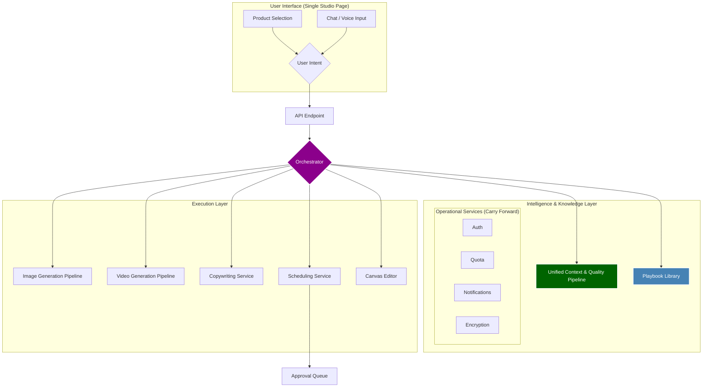

# Project Phoenix v2: The Complete Proposal

**Author:** Manus AI
**Date:** Mar 07, 2026
**Version:** 2.0

---

## 1. The Vision: A Shared Understanding (Unchanged)

Our vision remains the same:

> To create a **95% autonomous creative partner** that transforms NDS's raw product catalog into a stream of high-performing, brand-aligned social media content, ready for user approval with minimal intervention.

This vision is supported by the four pillars of **Deep Knowledge**, **Smart Intelligence**, **Unified UX**, and **Autonomous Workflow**.

---

## 2. The Phoenix v2 Architecture: A More Complete Picture

The core architecture is sound, but it must be expanded to explicitly incorporate the critical systems identified in the gap analysis. The new architecture is built around three core concepts: a **Unified Context & Quality Pipeline**, a **Playbook-Driven Orchestrator**, and a **Unified Studio UI**.

### High-Level Architecture (v2)

### Core Components (Revised)

1.  **The Unified Studio UI:** We will merge the `Studio`, `AgentChat`, `ProductLibrary`, and `CanvasEditor` into a single, cohesive page. This will be the user's primary workspace, allowing them to select products, chat/speak with the agent, see results, and perform AI-powered edits in one place.

2.  **The Playbook-Driven Orchestrator:** This new service will replace the current `agentRunner`. It will execute high-level "playbooks" that codify complex tasks. Playbooks will also be integrated with the **Experiment Service** to allow for A/B testing of different strategies (e.g., Playbook A uses one prompt, Playbook B uses another).
    - **New Playbook Example: `Generate_Carousel_Ad`**
      1.  `call:carouselOutlineService.generate()`
      2.  `forEach:outline.slides`
      3.  `call:UnifiedContextPipeline.build({ slide.imagePrompt })`
      4.  `call:imageGenerationPipeline.execute({ context })`
      5.  `end`
      6.  `call:copywritingService.generate({ context, slides })`
      7.  `return { images, copy }`

3.  **The Unified Context & Quality Pipeline:** This is the most significant change from v1. This new service will not only gather all context but also enforce quality at every step. It is a pipeline, not just a service.
    - **Pipeline Stages:**
      1.  **Context Assembly:** Gathers all 8 context sources (user prompt, brand, product, patterns, KB, vision, DNA, platform).
      2.  **Pre-Generation Gate:** Scores the assembled context for readiness. Blocks or warns if the prompt is underspecified.
      3.  **Execution:** Passes the context to the appropriate generation service (Image, Video, or Copy).
      4.  **Critic Stage:** Evaluates the generated output. If quality is below threshold, it triggers a silent re-generation with a revised prompt.
      5.  **Safety & Scoring:** Runs the final output through the Content Safety and Confidence Scoring services.
      6.  **Return:** Returns the final, high-quality, brand-safe result.

---

## 3. The 4-Phase Implementation Plan (v2)

This revised plan explicitly incorporates all 19 missed capabilities and provides a more realistic path to completion.

### Phase 1: The Unified Context & Quality Pipeline

- **Goal:** Consolidate all context and quality control into a single, robust pipeline.
- **Actions:**
  1.  Create the new `UnifiedContextQualityPipeline` service.
  2.  Integrate all 8 context sources, including **Pattern Extraction** and **Brand DNA**.
  3.  Integrate the **Pre-Generation Gate**, **Critic Stage**, **Content Safety**, and **Confidence Scoring** services into the pipeline.
  4.  Refactor the `imageGenerationPipeline` and `copywritingService` to use this new pipeline exclusively.
  5.  **Carry forward all operational services** (Auth, Quota, Notifications, Encryption, etc.) and ensure they are connected to the new pipeline where appropriate (e.g., Sentry for error tracking).
- **Outcome:** A dramatic increase in the quality, safety, and reliability of all generated content. All AI calls will be routed through a single, intelligent, quality-controlled system.

### Phase 2: The Autonomous Orchestrator & Core Playbooks

- **Goal:** Build the new orchestrator and the core playbooks for autonomous content creation, including video and A/B testing.
- **Actions:**
  1.  Create the new `OrchestratorService`.
  2.  Implement the core playbooks: `Generate_Single_Image_Post`, `Generate_Single_Video_Post`, `Generate_Carousel_Ad`, and the autonomous `Generate_Weekly_Plan`.
  3.  Integrate the **Experiment Service** into the orchestrator, allowing playbooks to be A/B tested.
  4.  Integrate the **Video Generation** pipeline as a first-class execution target for the orchestrator.
  5.  Preserve the **Model Fine-Tuning** capabilities and API, ensuring it can be used to improve the models used by the generation pipelines.
- **Outcome:** The system will be capable of autonomous, multi-format content generation with built-in support for continuous improvement via A/B testing.

### Phase 3: The Unified Studio UI

- **Goal:** Overhaul the frontend to create a single, seamless user experience that incorporates the new capabilities.
- **Actions:**
  1.  Create the new, unified `Studio` page that combines product selection, a rich chat interface (with **Voice Input**), and the generation canvas.
  2.  Integrate the **Canvas Editor** into the Studio as the primary post-generation editing tool.
  3.  Integrate the **Style Reference System** and **Brand Image Recommendation RAG** into the Studio's asset selection workflow.
  4.  Preserve the **Real-Time Collaboration** features within the new Studio.
  5.  Consolidate the UI as described in the v1 proposal, reducing navigation and creating the `Pipeline` and `Library` tabs.
- **Outcome:** A truly unified and powerful user experience that matches the sophistication of the backend.

### Phase 4: Final Integration, Deprecation & Delivery

- **Goal:** Ensure all components work together flawlessly, remove all legacy code, and deliver the final product.
- **Actions:**
  1.  Conduct end-to-end testing of all playbooks, UI flows, and all 19 preserved capabilities.
  2.  Systematically deprecate and remove all old services and UI components that have been replaced by the new architecture.
  3.  Verify that all **46 database tables** are correctly used by the new system, and consolidate where possible.
  4.  Update all documentation to reflect the new v2 architecture.
  5.  Merge the `claude/project-phoenix-v2` branch into `main` and deploy.
- **Outcome:** The project will be delivered, fully realizing the vision of an autonomous, intelligent, and user-friendly content generation platform, with no loss of existing critical functionality.

This updated proposal is a complete and realistic plan. I am ready to begin. Awaiting your approval.
