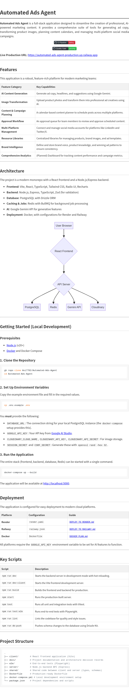

# Automated Ads Agent

**Automated Ads Agent** is a full-stack application designed to streamline the creation of professional, AI-powered marketing content. It provides a comprehensive suite of tools for generating ad copy, transforming product images, planning content calendars, and managing multi-platform social media campaigns.

[](https://github.com/Avi7702/Automated-Ads-Agent/actions/workflows/ci.yml)
[](https://github.com/Avi7702/Automated-Ads-Agent/actions/workflows/quality-gate-private.yml)

**Live Production URL:** [https://automated-ads-agent-production.up.railway.app](https://automated-ads-agent-production.up.railway.app)

---

## Features

This application is a robust, feature-rich platform for modern marketing teams:

| Feature Category                | Key Capabilities                                                                                |
| :------------------------------ | :---------------------------------------------------------------------------------------------- |
| **AI Content Generation**       | Generate ad copy, headlines, and suggestions using Google Gemini.                               |
| **Image Transformation**        | Upload product photos and transform them into professional ad creatives using AI.               |
| **Content & Campaign Planning** | A calendar-based content planner to schedule posts across multiple platforms.                   |
| **Approval Workflow**           | An approval queue for team members to review and approve scheduled content.                     |
| **Multi-Platform Management**   | Connect and manage social media accounts for platforms like LinkedIn and Twitter/X.             |
| **Resource Libraries**          | Centralized libraries for managing products, brand images, and ad templates.                    |
| **Brand Intelligence**          | Define and store brand voice, product knowledge, and winning ad patterns to ensure consistency. |
| **Comprehensive Analytics**     | (Planned) Dashboard for tracking content performance and campaign metrics.                      |

---

## Architecture

The project is a modern monorepo with a React frontend and a Node.js/Express backend.

- **Frontend**: Vite, React, TypeScript, Tailwind CSS, Radix UI, Recharts
- **Backend**: Node.js, Express, TypeScript, Zod (for validation)
- **Database**: PostgreSQL with Drizzle ORM
- **Caching & Jobs**: Redis with BullMQ for background job processing
- **AI**: Google Gemini API for generative features
- **Deployment**: Docker, with configurations for Render and Railway



---

## Getting Started (Local Development)

### Prerequisites

- [Node.js](https://nodejs.org/) (v20+)
- [Docker](https://www.docker.com/products/docker-desktop/) and Docker Compose

### 1. Clone the Repository

```bash
gh repo clone Avi7702/Automated-Ads-Agent
cd Automated-Ads-Agent
```

### 2. Set Up Environment Variables

Copy the example environment file and fill in the required values.

```bash
cp .env.example .env
```

You **must** provide the following:

- `DATABASE_URL`: The connection string for your local PostgreSQL instance (the `docker-compose` setup provides this).
- `GOOGLE_API_KEY`: Your API key from [Google AI Studio](https://aistudio.google.com/).
- `CLOUDINARY_CLOUD_NAME`, `CLOUDINARY_API_KEY`, `CLOUDINARY_API_SECRET`: For image storage.
- `SESSION_SECRET` and `CSRF_SECRET`: Generate these with `openssl rand -hex 32`.

### 3. Run the Application

The entire stack (frontend, backend, database, Redis) can be started with a single command.

```bash
docker-compose up --build
```

The application will be available at [http://localhost:5000](http://localhost:5000).

---

## Deployment

The application is configured for easy deployment to modern cloud platforms.

| Platform    | Configuration  | Guide                                            |
| :---------- | :------------- | :----------------------------------------------- |
| **Render**  | `render.yaml`  | [`DEPLOY_TO_RENDER.md`](./DEPLOY_TO_RENDER.md)   |
| **Railway** | `railway.json` | [`DEPLOY_TO_RAILWAY.md`](./DEPLOY_TO_RAILWAY.md) |
| **Docker**  | `Dockerfile`   | [`DOCKER_PLAN.md`](./DOCKER_PLAN.md)             |

All platforms require the `GOOGLE_API_KEY` environment variable to be set for AI features to function.

---

## Key Scripts

| Script               | Description                                                       |
| :------------------- | :---------------------------------------------------------------- |
| `npm run dev`        | Starts the backend server in development mode with hot-reloading. |
| `npm run dev:client` | Starts the Vite frontend development server.                      |
| `npm run build`      | Builds the frontend and backend for production.                   |
| `npm start`          | Runs the production-built server.                                 |
| `npm test`           | Runs all unit and integration tests with Vitest.                  |
| `npm run test:e2e`   | Runs end-to-end tests with Playwright.                            |
| `npm run lint`       | Lints the codebase for quality and style issues.                  |
| `npm run db:push`    | Pushes schema changes to the database using Drizzle Kit.          |

---

## Project Structure

```
.
├── client/         # React frontend application (Vite)
├── docs/           # Project documentation and architecture decision records
├── e2e/            # End-to-end tests (Playwright)
├── server/         # Node.js backend API (Express)
├── shared/         # Shared code between client and server (types, schemas)
├── Dockerfile      # Production-ready Dockerfile
├── docker-compose.yml # Local development environment setup
└── package.json    # Project dependencies and scripts
```
