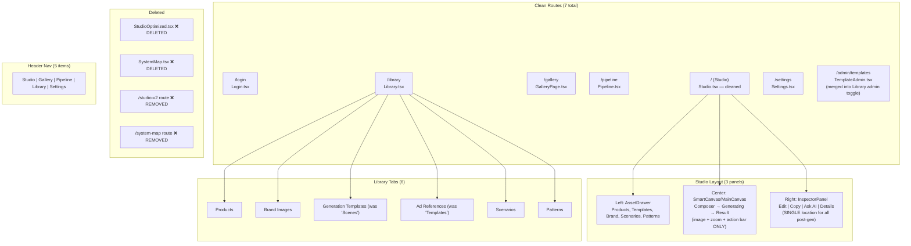
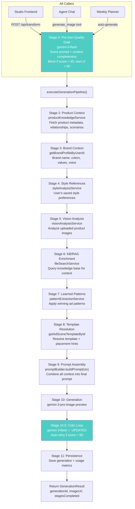
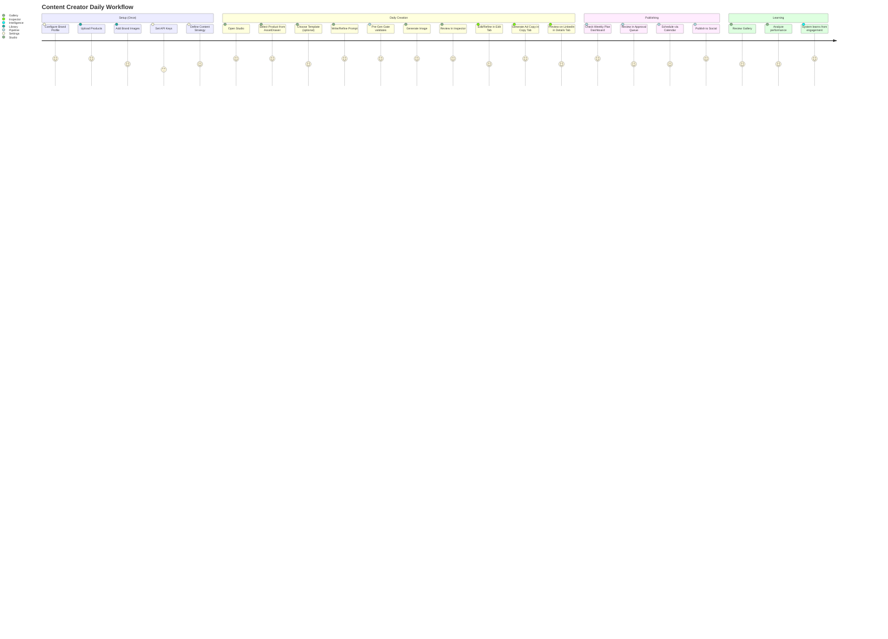
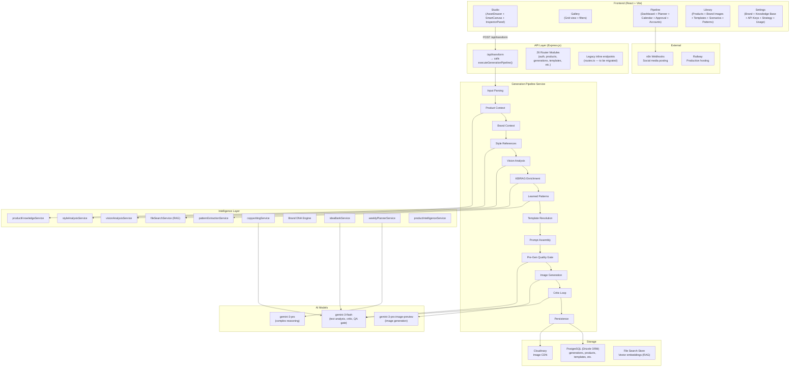

# Automated Ads Agent — System Architecture Upgrade Plan

**Date:** 2026-02-15
**Status:** DRAFT — Pending Approval
**Scope:** Full-stack architecture cleanup, pipeline wire-up, intelligence layer enhancement

---

## 1. Context & Vision

### The Problem

The Automated Ads Agent has grown organically across 6+ development phases, producing a capable but structurally inconsistent system. Three critical issues need resolution:

1. **Route/Component Bloat** — 22 page files exist in `client/src/pages/`, but only 8 routes are actively navigable. The remaining 14 are either legacy pages wrapped inside Library/Pipeline/Settings tabs, dead pages (StudioOptimized, SystemMap), or standalone admin tools (TemplateAdmin). The Header nav shows 5 items (Studio, Gallery, Pipeline, Library, Settings) but 15+ legacy routes still have redirects, creating confusion.

2. **Disconnected Image Generation Pipeline** — The main user-facing endpoint `/api/transform` (330+ lines inline in `server/routes.ts`, lines 556-1010) performs its own prompt building, brand injection, and Gemini API calls. Meanwhile, a full 11-stage `executeGenerationPipeline()` service exists in `server/services/generation/generationPipelineService.ts` with product context, style references, vision analysis, KB/RAG enrichment, learned patterns, template resolution, prompt assembly, critic loop, and persistence. But this pipeline is **only called by agent tools** (`server/services/agent/tools/generationTools.ts`), not by the main UI. Five context sources are completely disconnected from the user endpoint: product metadata, vision analysis, KB/RAG, style references, and aspect ratio.

3. **Studio UI Duplication** — `ResultViewEnhanced.tsx` (415 lines) contains Edit, Copy/Ask AI, LinkedIn Preview, History Timeline, and Canvas Editor — all inline in the center panel. The InspectorPanel (right panel) has dedicated tabs for the same: EditTab, CopyTab, AskAITab, DetailsTab. Users see the same functionality in two places. Additionally, `StudioOptimized.tsx` is a near-complete copy of Studio.tsx that was meant for A/B testing but is never used.

### The End Goal

An autonomous content generation system where:

- Every user generation flows through the full 11-stage pipeline (product context, brand, style, vision, KB, patterns, templates, prompt assembly, generation, critic, persistence)
- A pre-generation quality gate prevents wasting API calls on under-specified prompts
- The UI has zero duplication — each capability exists in exactly one place
- All AI models use current Gemini 3 family (not deprecated 2.x)
- Clean route structure with no dead pages or orphaned components
- Brand DNA persistence ("the system doesn't forget how your business works")

### Industry Comparison

| Capability                  | NoimosAI | Jasper AI       | Soshie/Brain AI | **Our Target**      |
| --------------------------- | -------- | --------------- | --------------- | ------------------- |
| End-to-end autonomous agent | Yes      | Partial         | Partial         | **Yes (Phase 5)**   |
| Brand voice training        | No       | Yes (core)      | Yes (core)      | **Yes (Brand DNA)** |
| Persistent brand context    | No       | Partial         | Yes (core)      | **Yes (Phase 5)**   |
| Pre-gen quality gate        | Unknown  | Unknown         | Unknown         | **Yes (Phase 3)**   |
| Multi-platform formatting   | Yes      | Yes             | Yes             | **Yes (existing)**  |
| Human-in-the-loop approval  | Yes      | No              | No              | **Yes (existing)**  |
| Performance feedback loop   | Yes      | Yes (analytics) | No              | **Yes (Phase 5)**   |
| Full context pipeline       | No       | No              | No              | **Yes (Phase 3)**   |

---

## 2. Current vs Target Architecture

### Diagram A: Current Frontend Route Architecture

```mermaid
graph TB
    subgraph "Active Routes (8 navigable)"
        R_LOGIN["/login<br/>Login.tsx"]
        R_STUDIO["/ (Studio)<br/>Studio.tsx — 2,963 lines"]
        R_GALLERY["/gallery<br/>GalleryPage.tsx"]
        R_PIPELINE["/pipeline<br/>Pipeline.tsx"]
        R_LIBRARY["/library<br/>Library.tsx"]
        R_SETTINGS["/settings<br/>Settings.tsx"]
        R_ADMIN["/admin/templates<br/>TemplateAdmin.tsx"]
        R_SYSMAP["/system-map<br/>SystemMap.tsx"]
    end

    subgraph "Dead Route (should delete)"
        R_STUDIOV2["/studio-v2<br/>StudioOptimized.tsx ❌"]
    end

    subgraph "Legacy Redirects → Pipeline"
        R_CP["/content-planner → /pipeline?tab=planner"]
        R_AQ["/approval-queue → /pipeline?tab=approval"]
        R_SA["/social-accounts → /pipeline?tab=accounts"]
    end

    subgraph "Legacy Redirects → Library"
        R_PROD["/products → /library?tab=products"]
        R_IS["/installation-scenarios → /library?tab=scenarios"]
        R_BI["/brand-images → /library?tab=brand-images"]
        R_TL["/template-library → /library?tab=templates"]
        R_LFW["/learn-from-winners → /library?tab=patterns"]
        R_TMPL["/templates → /library?tab=scene-templates"]
    end

    subgraph "Legacy Redirects → Settings/Studio"
        R_USAGE["/usage → /settings?section=usage"]
        R_APIKEYS["/settings/api-keys → /settings?section=api-keys"]
        R_BRAND["/brand-profile → /settings"]
        R_GEN["/generation/:id → /?generation=:id"]
    end

    subgraph "Orphaned Page Files (no route, still on disk)"
        O1["ContentPlanner.tsx — embedded in Pipeline"]
        O2["ApprovalQueue.tsx — embedded in Pipeline"]
        O3["SocialAccounts.tsx — embedded in Pipeline"]
        O4["ProductLibrary.tsx — embedded in Library"]
        O5["BrandImageLibrary.tsx — embedded in Library"]
        O6["TemplateLibrary.tsx — embedded in Library"]
        O7["Templates.tsx — embedded in Library"]
        O8["InstallationScenarios.tsx — embedded in Library"]
        O9["LearnFromWinners.tsx — embedded in Library"]
        O10["BrandProfile.tsx — embedded in Settings"]
        O11["ApiKeySettings.tsx — embedded in Settings"]
        O12["QuotaDashboard.tsx — embedded in Settings"]
    end

    R_PIPELINE -- "lazy loads" --> O1 & O2 & O3
    R_LIBRARY -- "lazy loads" --> O4 & O5 & O6 & O7 & O8 & O9
    R_SETTINGS -- "lazy loads" --> O10 & O11 & O12
```



### Diagram B: Target Frontend Route Architecture



### Diagram C: Current Image Generation Flow (Disconnected)

```mermaid
flowchart TB
    subgraph "User UI Path"
        UI[Studio Frontend] -->|"POST /api/transform"| INLINE["/api/transform<br/>330 lines inline in routes.ts"]
        INLINE --> PROMPT["Inline prompt building<br/>(3 modes: standard, exact_insert, inspiration)"]
        PROMPT --> BRAND_INLINE["Inline brand injection<br/>(getBrandProfileByUserId)"]
        BRAND_INLINE --> RECIPE_INLINE["Inline recipe context<br/>(relationships, scenarios)"]
        RECIPE_INLINE --> GEMINI["gemini-3-pro-image-preview<br/>(direct call)"]
        GEMINI --> SAVE["Save to DB + Cloudinary"]
    end

    subgraph "Missing from User Path ❌"
        M1["❌ Product metadata (productIds not sent)"]
        M2["❌ Vision analysis (never called)"]
        M3["❌ KB/RAG enrichment (never queried)"]
        M4["❌ Style references (silently discarded)"]
        M5["❌ Aspect ratio (not passed to Gemini)"]
        M6["❌ Learned patterns (never applied)"]
        M7["❌ Critic loop (no post-gen QA)"]
        M8["❌ Pre-gen quality gate (no validation)"]
    end

    subgraph "Agent Tool Path (WORKS)"
        AGENT[Agent Chat] -->|"generate_image tool"| PIPELINE["executeGenerationPipeline()"]
        PIPELINE --> S2["Stage 2: Product Context<br/>productKnowledgeService"]
        S2 --> S3["Stage 3: Brand Context<br/>storage.getBrandProfile"]
        S3 --> S4["Stage 4: Style References<br/>styleAnalysisService"]
        S4 --> S5["Stage 5: Vision Analysis<br/>visionAnalysisService"]
        S5 --> S6["Stage 6: KB/RAG<br/>fileSearchService"]
        S6 --> S7["Stage 7: Learned Patterns<br/>patternExtractionService"]
        S7 --> S8["Stage 8: Template Resolution"]
        S8 --> S9["Stage 9: Prompt Assembly<br/>promptBuilder"]
        S9 --> S10["Stage 10: Generation<br/>Gemini API"]
        S10 --> S105["Stage 10.5: Critic Loop<br/>gemini-2.5-flash ⚠️ OLD MODEL"]
        S105 --> S11["Stage 11: Persistence"]
    end

    style M1 fill:#ff6b6b,color:#fff
    style M2 fill:#ff6b6b,color:#fff
    style M3 fill:#ff6b6b,color:#fff
    style M4 fill:#ff6b6b,color:#fff
    style M5 fill:#ff6b6b,color:#fff
    style M6 fill:#ff6b6b,color:#fff
    style M7 fill:#ff6b6b,color:#fff
    style M8 fill:#ff6b6b,color:#fff
    style S105 fill:#ffa502,color:#fff
```



### Diagram D: Target Image Generation Flow (Unified Pipeline)



### Diagram E: User Journey Map (Target System)



### Diagram F: System Architecture Overview



---

## 3. Implementation Phases

### Phase 1: Foundation Fixes (Low Risk, High Impact)

**Goal:** Remove dead code, update deprecated models, fix dead buttons.

#### 1.1 Delete StudioOptimized

- **Delete:** `client/src/pages/StudioOptimized.tsx`
- **Delete:** `client/src/components/studio/memoized/StudioHeader.tsx`
- **Delete:** `client/src/components/studio/memoized/StudioSidebar.tsx`
- **Delete:** `client/src/components/studio/memoized/StudioCanvas.tsx`
- **Delete:** `client/src/components/studio/memoized/StudioToolbar.tsx`
- **Modify:** `client/src/App.tsx` — Remove `/studio-v2` route (line 159-165), remove `StudioOptimized` import (line 20)
- **Verify:** Build passes, `/studio-v2` returns 404

#### 1.2 Delete SystemMap (developer tool, not user-facing)

- **Delete:** `client/src/pages/SystemMap.tsx`
- **Modify:** `client/src/App.tsx` — Remove `/system-map` route (lines 150-156), remove `SystemMap` import (line 28)

#### 1.3 Update All Gemini Model References

**Files requiring changes (source files only, not coverage/docs):**

| File                                            | Current Model                 | Target Model                | Line     |
| ----------------------------------------------- | ----------------------------- | --------------------------- | -------- |
| `server/services/generation/criticStage.ts`     | `gemini-2.5-flash`            | `gemini-3-flash`            | 38       |
| `server/services/patternPrivacyFilter.ts`       | `gemini-2.5-flash`            | `gemini-3-flash`            | 18       |
| `server/services/enrichment/sourceDiscovery.ts` | `gemini-2.5-flash`            | `gemini-3-flash`            | 34       |
| `server/services/enrichment/aiHelpers.ts`       | `gemini-2.5-flash`            | `gemini-3-flash`            | 25       |
| `server/services/templatePatternRAG.ts`         | `gemini-2.0-flash`            | `gemini-3-flash`            | 522, 616 |
| `server/services/relationshipDiscoveryRAG.ts`   | `gemini-2.0-flash`            | `gemini-3-flash`            | 90       |
| `server/services/installationScenarioRAG.ts`    | `gemini-2.0-flash`            | `gemini-3-flash`            | 171      |
| `server/services/enrichmentServiceWithUrl.ts`   | `gemini-2.0-flash`            | `gemini-3-flash`            | 68, 172  |
| `server/routes/generations.router.ts`           | `gemini-2.0-flash-exp`        | `gemini-3-flash`            | 317      |
| `server/routes/training.router.ts`              | `gemini-2.5-flash`            | `gemini-3-flash`            | 71       |
| `server/services/modelTrainingService.ts`       | `gemini-2.5-flash-001-tuning` | `gemini-3-flash-001-tuning` | 19       |
| `server/lib/geminiClient.ts`                    | Old fallback chain            | Updated fallback chain      | 178-180  |
| `shared/schema.ts`                              | `gemini-2.5-flash` default    | `gemini-3-flash` default    | 2002     |

**Also update migration if needed:** `migrations/0003_fat_sumo.sql` line 212

#### 1.4 Fix Dead Buttons

| Button            | Location                    | Issue                    | Fix                                                           |
| ----------------- | --------------------------- | ------------------------ | ------------------------------------------------------------- |
| Gallery Delete    | `GalleryPage.tsx`           | onClick does nothing     | Wire to `DELETE /api/generations/:id`                         |
| n8n Sync          | `SocialAccounts.tsx`        | Shows "not implemented"  | Wire to `/api/social/sync-accounts` or hide until implemented |
| History Favorites | `HistoryTimeline` component | Tab exists, always empty | Remove favorites tab OR implement with localStorage           |
| 404 No Links      | `not-found.tsx`             | No navigation links      | Add "Go to Studio" and "Go Home" buttons                      |

#### Phase 1 Verification

- [ ] `npx vite build` passes with zero errors
- [ ] `/studio-v2` returns NotFound page
- [ ] `/system-map` returns NotFound page
- [ ] `grep -r "gemini-2" server/` returns zero results (excluding node_modules, coverage, docs)
- [ ] Gallery delete button actually deletes
- [ ] 404 page has navigation links
- [ ] All existing tests pass: `npm test`

---

### Phase 2: Studio Deduplication (Medium Risk, High Impact)

**Goal:** Remove inline Edit/Copy/AskAI/Preview from ResultViewEnhanced. The InspectorPanel becomes the single location for all post-generation actions.

#### 2.1 Simplify ResultViewEnhanced

**Current ResultViewEnhanced (415 lines) contains:**

- Plan context banner (keep)
- Result header with Start New + Download + View Details (keep)
- Generated image with zoom (keep)
- Action button bar: Edit, AI Canvas, Copy, Preview, Save, Copy Text (modify)
- History Timeline (move to InspectorPanel DetailsTab)
- Inline Edit section with prompt + presets + Apply (REMOVE — exists in InspectorPanel EditTab)
- Inline Ask AI / Copy Generation section (REMOVE — exists in InspectorPanel CopyTab & AskAITab)
- Inline LinkedIn Preview section (REMOVE — exists in InspectorPanel DetailsTab)
- Canvas Editor overlay (keep — this is unique)

**Target ResultViewEnhanced (~120 lines):**

- Plan context banner
- Result header (Start New, Download, View Details)
- Generated image with zoom
- Simplified action bar: AI Canvas, Save, Download, Copy Text
- Canvas Editor overlay

**Action button changes:**

- Remove Edit button (use InspectorPanel EditTab)
- Remove Copy button (use InspectorPanel CopyTab)
- Remove Preview button (use InspectorPanel DetailsTab)
- Keep AI Canvas (unique — opens fullscreen editor overlay)
- Keep Save (opens save-to-catalog dialog)
- Keep Copy Text (quick clipboard action)

#### 2.2 Enhance InspectorPanel Tabs

**EditTab:** Already has edit prompt + apply — verify it works with `orch.handleApplyEdit`

**CopyTab:** Already has copy generation — verify it includes:

- Ask AI question input
- Generated ad copy with read-aloud
- Copy to clipboard

**AskAITab:** Already exists — verify it has the question/answer flow

**DetailsTab:** Add:

- LinkedIn Preview (moved from ResultViewEnhanced)
- History Timeline (moved from ResultViewEnhanced)
- Generation metadata (prompt, mode, template, resolution)

#### 2.3 Ensure InspectorPanel Shows Conditionally

The InspectorPanel should only be visible when there's a generated image (`orch.generatedImage` is truthy). In the composer state, the right panel should show context/help or be collapsed.

#### Phase 2 Verification

- [ ] After generation, Edit/Copy/AskAI only appear in InspectorPanel (right panel)
- [ ] No duplicate UI elements between center and right panel
- [ ] AI Canvas button still opens fullscreen editor
- [ ] History Timeline visible in DetailsTab
- [ ] LinkedIn Preview visible in DetailsTab
- [ ] `npx vite build` passes
- [ ] All interactive elements work (edit applies, copy generates, etc.)

---

### Phase 3: Pipeline Wire-Up (High Impact, Core Fix)

**Goal:** Make `/api/transform` call `executeGenerationPipeline()` instead of doing everything inline. Add pre-generation quality gate.

#### 3.1 Migrate /api/transform to Pipeline

**Current inline flow (routes.ts lines 556-1010):**

1. Parse files, prompt, resolution, mode, templateId, recipe
2. Build enhanced prompt (3 modes: standard, exact_insert, inspiration)
3. Inject brand profile
4. Inject recipe context
5. Build userParts with template reference images + product images + prompt
6. Call `gemini-3-pro-image-preview`
7. Save original files, generated image, conversation history
8. Save generation usage

**Target flow:**

1. Parse request exactly as before (same FormData interface — no frontend changes)
2. Convert to `GenerationInput` type:
   ```typescript
   const input: GenerationInput = {
     prompt,
     mode: generationMode as GenerationMode,
     images: files.map((f) => ({
       buffer: f.buffer,
       mimetype: f.mimetype,
       originalname: f.originalname,
     })),
     templateId: templateId || undefined,
     templateReferenceUrls: templateReferenceUrls || undefined,
     recipe: recipe || undefined,
     styleReferenceIds: req.body.styleReferenceIds || undefined,
     resolution: selectedResolution as '1K' | '2K' | '4K',
     userId: userId!,
   };
   ```
3. Call `executeGenerationPipeline(input)`
4. Return `GenerationResult` to frontend

**Frontend FormData additions needed:**

- `productIds` — Array of selected product IDs (from AssetDrawer selection)
- `styleReferenceIds` — Array of style reference IDs (from StyleReferenceSelector)
- `aspectRatio` — Selected aspect ratio string

**GenerationInput type additions:**

- Add `productIds?: string[]` to `GenerationInput` interface
- Add `aspectRatio?: string` to `GenerationInput` interface
- Pipeline Stage 2 should use `productIds` from input, not just from recipe

#### 3.2 Add Pre-Generation Quality Gate (Stage 0 / Stage 9.5)

**Location:** New file `server/services/generation/preGenGate.ts`

**Logic:**

```
Score the generation request on:
- Prompt specificity (0-25): Is the prompt detailed enough?
- Context completeness (0-25): Are product/brand/template contexts available?
- Image quality (0-25): Are uploaded images high-res and relevant?
- Consistency (0-25): Do prompt, template, and brand guidelines align?

Total score 0-100:
- < 40: BLOCK — return error with specific improvement suggestions
- 40-60: WARN — proceed but log warning, include suggestions in response
- > 60: PASS — proceed normally
```

**Model:** `gemini-3-flash` (fast, cheap — evaluation only)

**Integration point:** Between Stage 9 (Prompt Assembly) and Stage 10 (Generation), as "Stage 9.5". The assembled prompt + context is evaluated before the expensive image generation call.

#### 3.3 Update Pipeline Mode Handling

The current pipeline's `promptBuilder.ts` must handle the 3 generation modes (standard, exact_insert, inspiration) that are currently inline in routes.ts. The mode-specific prompt construction logic (lines 631-728 in routes.ts) should move to `promptBuilder.ts`.

#### Phase 3 Verification

- [ ] `/api/transform` delegates to `executeGenerationPipeline()`
- [ ] All 11 stages fire (check logs for `stagesCompleted` array)
- [ ] Frontend form sends `productIds`, `styleReferenceIds`, `aspectRatio`
- [ ] Pre-gen gate blocks deliberately bad prompts (test with "asdf")
- [ ] Pre-gen gate passes good prompts
- [ ] Critic loop uses `gemini-3-flash` (not 2.5)
- [ ] Generated images are saved with full pipeline metadata
- [ ] Conversation history preserved for edit support
- [ ] No regression: existing generation flows still work
- [ ] Agent chat generation still works (shares same pipeline)
- [ ] `npm test` — all tests pass

---

### Phase 4: Template System Cleanup (Medium Risk, Medium Impact)

**Goal:** Resolve the confusing two-template-system problem and merge admin into Library.

#### 4.1 Rename Template Systems

**Current confusion:**

- `AdSceneTemplate` — Called "Scenes" in Library tab (`scene-templates`). These are generation blueprints with prompt blueprints, placement hints, mood, lighting, environment. Used by `/api/transform` for `exact_insert` and `inspiration` modes. Managed in `/admin/templates` (TemplateAdmin page).
- `PerformingAdTemplate` — Called "Templates" in Library tab (`templates`). These are reference ads from competitors/winners. They have engagement scores, performance metrics, platform targeting. Managed via `TemplateLibrary.tsx`.

Both are called "templates" which confuses users.

**Rename:**
| Current | New Name | Description |
|---|---|---|
| AdSceneTemplate / "Scenes" tab | **Generation Templates** | Blueprints that guide image generation |
| PerformingAdTemplate / "Templates" tab | **Ad References** | Real-world ad examples to learn from |

**UI changes:**

- Library tab `scene-templates` label → "Gen Templates"
- Library tab `templates` label → "Ad References"
- All UI text referring to "scenes" → "generation templates"
- All UI text referring to "performing ad templates" → "ad references"

#### 4.2 Merge TemplateAdmin into Library

Currently `/admin/templates` (TemplateAdmin.tsx) is a standalone page for managing AdSceneTemplates. It should be merged into the Library's "Gen Templates" tab with an admin toggle.

**Approach:**

- Add an "Admin Mode" toggle button to the Gen Templates tab header
- When toggled on, show CRUD operations (create, edit, delete)
- When toggled off, show read-only template browser (current behavior)
- Remove `/admin/templates` route from App.tsx
- Delete TemplateAdmin.tsx (functionality absorbed into Library)

#### 4.3 Extract Shared Components

Several components are duplicated across template-related pages:

- **ProductPicker** — Used in TemplateAdmin, Studio AssetDrawer, IdeaBank
- **DeleteDialog** — Confirmation dialog pattern repeated everywhere
- **TagInput** — Tag management for templates, patterns

Extract into `client/src/components/shared/`:

- `ProductPicker.tsx`
- `ConfirmDialog.tsx`
- `TagInput.tsx`

#### Phase 4 Verification

- [ ] Library shows "Gen Templates" and "Ad References" tabs
- [ ] Admin mode toggle works for Gen Templates
- [ ] `/admin/templates` removed, redirects to `/library?tab=gen-templates`
- [ ] All template CRUD still works
- [ ] Legacy redirect `/templates` still works
- [ ] No broken imports or references
- [ ] `npx vite build` passes

---

### Phase 5: Intelligence Layer Enhancement (High Impact, Long-term)

**Goal:** Move from "simple automation" to "autonomous agent with persistent brand context."

#### 5.1 Brand DNA Engine

**Concept:** The system builds and maintains a persistent understanding of the brand that enriches every generation.

**Current state:**

- `brandProfile` in DB has: name, preferredStyles, brandValues, colorPreferences, voice
- These are injected as plain text into prompts

**Target state:**

- New `brandDNA` table:
  ```
  brandDNA {
    id, userId,
    toneAnalysis: jsonb,      // Analyzed from existing content
    visualSignature: jsonb,   // Extracted from brand images
    audienceProfile: jsonb,   // From engagement data
    competitorDiff: jsonb,    // How we differ from competitors
    contentRules: jsonb,      // Auto-learned do's and don'ts
    lastAnalyzedAt: timestamp,
    version: integer
  }
  ```
- Auto-analyzed from: brand images, successful generations, brand profile text, engagement data
- Re-analyzed periodically (weekly or on significant content change)
- Injected into pipeline Stage 3 (Brand Context) as structured data

#### 5.2 Performance Feedback Loop

**Current state:** Generations are saved with basic metadata. No feedback from actual social media performance.

**Target state:**

- New `generationPerformance` table:
  ```
  generationPerformance {
    id, generationId,
    platform: varchar,
    impressions: integer,
    engagement: float,
    clicks: integer,
    conversions: integer,
    fetchedAt: timestamp
  }
  ```
- n8n webhooks already post to social media — extend to fetch engagement data back
- Feed engagement data into:
  - Pattern extraction (Stage 7): Learn what works
  - Brand DNA: Update audience profile
  - Idea Bank: Boost high-performing content patterns
  - Weekly Planner: Optimize content mix

#### 5.3 Multi-Platform Content Adaptation

**Current state:** Platform-specific formatting exists in copywritingService. Image generation ignores platform.

**Target state:**

- Pipeline Stage 9 (Prompt Assembly) incorporates platform-specific image guidelines:
  - Instagram: Square (1:1) or vertical (4:5), vibrant, lifestyle-focused
  - LinkedIn: Horizontal (1.91:1), professional, data-driven
  - TikTok: Vertical (9:16), bold text, high contrast
  - Facebook: Flexible, but 1.91:1 for ads
  - X/Twitter: Horizontal (16:9), clean, text-minimal
- Frontend adds platform selector to Studio OutputSettings
- Platform selection auto-adjusts aspect ratio and prompt assembly

#### 5.4 Approval Workflow Improvements

**Current state:** Approval queue exists but is manual.

**Target state:**

- Auto-submit generations that score > 80 on critic
- Flag generations that score 40-80 for human review
- Auto-reject generations that score < 40
- Approval dashboard shows critic score, brand consistency score
- One-click approve + schedule (combines approval + calendar)

#### Phase 5 Verification

- [ ] Brand DNA analysis runs on existing brand data
- [ ] Brand DNA enriches generation prompts
- [ ] Performance data flows back from social media
- [ ] Pattern extraction uses performance data
- [ ] Platform-specific prompt adaptation works
- [ ] Approval workflow auto-categorizes by score
- [ ] End-to-end: create content → publish → track → learn → improve

---

## 4. Verification Steps (Cross-Phase)

### After Each Phase

1. **Build verification:** `npx vite build` produces clean output
2. **Test suite:** `npm test` — all existing tests pass
3. **Type checking:** `npx tsc --noEmit` — no TypeScript errors (note: studio files use `@ts-nocheck`)
4. **Route verification:** All 5 nav items work, all legacy redirects work
5. **Generation flow:** Upload product image → write prompt → generate → image appears
6. **Edit flow:** Generated image → Edit tab → apply edit → updated image
7. **Copy flow:** Generated image → Copy tab → generate copy → text appears
8. **Mobile:** Responsive layout works on mobile viewports

### Final Integration Test

1. Create brand profile in Settings
2. Upload products in Library
3. Open Studio, select product from AssetDrawer
4. Write prompt, generate image
5. Verify pipeline stages in server logs (all 11 stages + pre-gen gate)
6. Edit image using InspectorPanel EditTab
7. Generate ad copy using CopyTab
8. Preview on LinkedIn in DetailsTab
9. Save to Gallery
10. Schedule in Pipeline Calendar
11. Verify in Gallery page
12. Check approval queue

---

## 5. Risk Assessment

### Phase 1: Foundation Fixes — LOW RISK

| Risk                                      | Likelihood | Impact | Mitigation                                           |
| ----------------------------------------- | ---------- | ------ | ---------------------------------------------------- |
| Deleting StudioOptimized breaks something | Low        | Low    | Grep for all imports before deleting                 |
| Gemini 3 model names wrong                | Medium     | High   | Verify model IDs from Google AI docs before changing |
| Dead button fixes introduce regressions   | Low        | Low    | Each fix is isolated, easy to test                   |

### Phase 2: Studio Deduplication — MEDIUM RISK

| Risk                                            | Likelihood | Impact | Mitigation                                                                                  |
| ----------------------------------------------- | ---------- | ------ | ------------------------------------------------------------------------------------------- |
| Users lose functionality during transition      | Medium     | High   | Verify InspectorPanel tabs have full feature parity before removing from ResultViewEnhanced |
| Orchestrator state breaks when sections removed | Low        | Medium | `useStudioOrchestrator` hook manages all state — removing UI doesn't affect state           |
| Mobile layout breaks                            | Medium     | Medium | Test responsive breakpoints after changes                                                   |

### Phase 3: Pipeline Wire-Up — HIGH RISK (but highest reward)

| Risk                                              | Likelihood | Impact | Mitigation                                                                                                 |
| ------------------------------------------------- | ---------- | ------ | ---------------------------------------------------------------------------------------------------------- |
| Pipeline stages fail silently                     | Medium     | High   | Each stage is fault-tolerant (continues without failed stage), but log all failures                        |
| Pre-gen gate too aggressive (blocks good prompts) | Medium     | High   | Start with low threshold (score < 30 blocks), tune upward                                                  |
| Conversation history format changes break edits   | Medium     | High   | Ensure pipeline persists same conversation history format as current inline code                           |
| Generation time increases (more stages)           | High       | Medium | Stages 2-8 are context-gathering (fast, <2s each). Generation (Stage 10) is unchanged. Set timeout budget. |
| Frontend FormData changes break existing flow     | Low        | High   | Make new fields optional; pipeline handles missing data gracefully                                         |

### Phase 4: Template Cleanup — LOW-MEDIUM RISK

| Risk                                     | Likelihood | Impact | Mitigation                                                                          |
| ---------------------------------------- | ---------- | ------ | ----------------------------------------------------------------------------------- |
| Renaming confuses existing users         | Low        | Low    | This is a naming cleanup — the functionality doesn't change                         |
| TemplateAdmin merge loses admin features | Medium     | Medium | Verify all CRUD operations work in Library admin mode before deleting TemplateAdmin |

### Phase 5: Intelligence Layer — MEDIUM-HIGH RISK

| Risk                                      | Likelihood | Impact | Mitigation                                                                       |
| ----------------------------------------- | ---------- | ------ | -------------------------------------------------------------------------------- |
| Brand DNA analysis produces poor results  | Medium     | Medium | Start simple: extract from brand profile + successful generations only           |
| Performance feedback requires n8n changes | High       | Medium | May need new n8n workflows for engagement data retrieval                         |
| Over-optimization makes content generic   | Medium     | High   | Always include user prompt as primary signal; brand DNA is context, not override |

---

## 6. Dependency Graph

```
Phase 1 ──────────────── (no dependencies, start immediately)
     │
     ▼
Phase 2 ──────────────── (depends on Phase 1 cleanup)
     │
     ▼
Phase 3 ──────────────── (depends on Phase 1 model updates, independent of Phase 2)
     │
     ▼
Phase 4 ──────────────── (independent of Phases 2-3, can run in parallel)
     │
     ▼
Phase 5 ──────────────── (depends on Phase 3 pipeline being live)
```

**Parallelism opportunities:**

- Phase 1 → Then Phase 2 and Phase 3 can run in parallel
- Phase 4 can run any time after Phase 1
- Phase 5 must wait for Phase 3

---

## 7. Files Inventory

### Files to DELETE (Phase 1)

- `client/src/pages/StudioOptimized.tsx`
- `client/src/components/studio/memoized/StudioHeader.tsx`
- `client/src/components/studio/memoized/StudioSidebar.tsx`
- `client/src/components/studio/memoized/StudioCanvas.tsx`
- `client/src/components/studio/memoized/StudioToolbar.tsx`
- `client/src/pages/SystemMap.tsx`

### Files to MODIFY (Phase 1)

- `client/src/App.tsx` — Remove routes + imports
- `server/services/generation/criticStage.ts` — Model update
- `server/services/patternPrivacyFilter.ts` — Model update
- `server/services/enrichment/sourceDiscovery.ts` — Model update
- `server/services/enrichment/aiHelpers.ts` — Model update
- `server/services/templatePatternRAG.ts` — Model update (2 locations)
- `server/services/relationshipDiscoveryRAG.ts` — Model update
- `server/services/installationScenarioRAG.ts` — Model update
- `server/services/enrichmentServiceWithUrl.ts` — Model update (2 locations)
- `server/routes/generations.router.ts` — Model update
- `server/routes/training.router.ts` — Model update
- `server/services/modelTrainingService.ts` — Model update
- `server/lib/geminiClient.ts` — Fallback chain update
- `shared/schema.ts` — Default model update

### Files to MODIFY (Phase 2)

- `client/src/components/studio/MainCanvas/ResultViewEnhanced.tsx` — Major reduction
- `client/src/components/studio/InspectorPanel/tabs/DetailsTab.tsx` — Add History + Preview

### Files to MODIFY (Phase 3)

- `server/routes.ts` — Replace inline /api/transform with pipeline call
- `server/types/generationPipeline.ts` — Add productIds, aspectRatio to GenerationInput
- `server/services/generation/generationPipelineService.ts` — Add pre-gen gate call
- `server/services/generation/promptBuilder.ts` — Add 3-mode prompt construction

### Files to CREATE (Phase 3)

- `server/services/generation/preGenGate.ts` — Pre-generation quality gate

### Files to MODIFY (Phase 4)

- `client/src/pages/Library.tsx` — Rename tabs
- `client/src/App.tsx` — Remove /admin/templates route

### Files to DELETE (Phase 4)

- `client/src/pages/TemplateAdmin.tsx` — Merged into Library

### Files to CREATE (Phase 5)

- `server/services/brandDNAService.ts` — Brand DNA engine
- `shared/schema.ts` additions — brandDNA table, generationPerformance table

---

## 8. Estimated Scope (Original Phases 1-5)

| Phase     | Files Changed | Files Deleted | Files Created | Complexity |
| --------- | ------------- | ------------- | ------------- | ---------- |
| Phase 1   | 14            | 6             | 0             | Low        |
| Phase 2   | 2-3           | 0             | 0             | Medium     |
| Phase 3   | 4-5           | 0             | 1             | High       |
| Phase 4   | 2-3           | 1             | 0             | Medium     |
| Phase 5   | 3-5           | 0             | 2-3           | High       |
| **Total** | **~28**       | **~7**        | **~4**        |            |

---

# PART 2: Project Health Audit & Path to 100%

> Added: 2026-02-15 after comprehensive 3-agent deep-dive analysis of entire codebase

## 9. Current State: Honest Assessment

**Overall Score: 6.5 / 10**

| Dimension             | Score  | Blocker? | Key Evidence                                                           |
| --------------------- | ------ | -------- | ---------------------------------------------------------------------- |
| Code Quality          | 7/10   | No       | Modern stack, but 101 `@ts-nocheck` files bypass strict TS             |
| Test Coverage         | 6.5/10 | **YES**  | 548 test files but 4 actively failing, integration tests skipped in CI |
| Documentation         | 5/10   | Partial  | README describes wrong project, no API docs, no ISSUE-TRACKER.md       |
| Dependency Security   | 5/10   | **YES**  | 4 unpatched vulnerabilities (HIGH + MODERATE)                          |
| CI/CD                 | 7/10   | Partial  | E2E only on main, security audit non-blocking                          |
| Infrastructure        | 6/10   | **YES**  | No Dockerfile for production                                           |
| Agent Intelligence    | 4/10   | No       | Tool executor, no memory, no learning, no initiative                   |
| Frontend Architecture | 5/10   | No       | 75+ useState in one hook, 11 god components, prop drilling             |

### Critical Gaps (28 total identified)

**CRITICAL (5):** 101 @ts-nocheck files, 4 failing tests, 4 security vulns, 5710-line routes.ts, 75+ useState hook
**HIGH (9):** Integration tests skipped in CI, E2E only on main, wrong README, no API docs, 150 eslint warnings allowed, no ISSUE-TRACKER, agent blind to UI state, agent has no brand context, sessions in-memory only
**MEDIUM (10):** 11 god components, 153 `any` types, no form validation framework, scattered localStorage, silent errors, no Dockerfile, 1358-line ideaBankService, security audit non-blocking, 491 TODOs, generic agent errors
**LOW (4):** No a11y testing, stale branches, no secrets scanning, redundant docs

---

## 10. Path to 100%: Four Tiers

### Tier 1: Fix What's Broken (6.5 → 8.0)

> Prerequisite for everything else. Unblocks CI, patches security, delivers core value.

| #    | Task                                                                          | Files                                        | Effort          | Status  |
| ---- | ----------------------------------------------------------------------------- | -------------------------------------------- | --------------- | ------- |
| T1.1 | Fix 4 failing tests (Studio-generation, Studio-layout, library, HistoryPanel) | `client/src/components/__tests__/*.test.tsx` | 1 day           | Pending |
| T1.2 | Patch security vulnerabilities — upgrade `fabric` to 7.x, fix `drizzle-kit`   | `package.json`                               | 1 day           | Pending |
| T1.3 | Phase 1: Delete dead code + update Gemini models                              | 20 files                                     | **In Progress** | Running |
| T1.4 | Phase 2: Studio deduplication                                                 | 3 files                                      | 2 days          | Pending |
| T1.5 | Phase 3: Pipeline wire-up + pre-gen QA gate                                   | 6 files                                      | 3 days          | Pending |
| T1.6 | Fix README — document actual project, not SDD toolkit                         | `README.md`                                  | 1 hour          | Pending |
| T1.7 | Create ISSUE-TRACKER.md (required by CLAUDE.md)                               | `docs/ISSUE-TRACKER.md`                      | 1 hour          | Pending |
| T1.8 | Set pre-commit to 0 eslint warnings (currently 150)                           | `.husky/pre-commit`, `package.json`          | 1 hour          | Pending |
| T1.9 | Make security audit block CI (remove `continue-on-error`)                     | `.github/workflows/ci.yml`                   | 1 hour          | Pending |

### Tier 2: Production-Grade Quality (8.0 → 9.0)

> Structural refactoring. Makes the codebase maintainable and deployable.

| #     | Task                                                                                             | Files                                                 | Effort |
| ----- | ------------------------------------------------------------------------------------------------ | ----------------------------------------------------- | ------ |
| T2.1  | Remove `@ts-nocheck` from 101 files — fix underlying TS errors                                   | 101 client files                                      | 3 days |
| T2.2  | Split `useStudioOrchestrator` (75+ useState) into 5 focused hooks                                | `client/src/hooks/useStudio*.ts`                      | 2 days |
| T2.3  | Break `routes.ts` monolith (5,710 lines) — move remaining inline endpoints to modular routers    | `server/routes.ts`, `server/routes/*.ts`              | 2 days |
| T2.4  | Split god components: BusinessOnboarding (862), ComposerView (764), ContentPlannerGuidance (779) | 3-4 component directories                             | 2 days |
| T2.5  | Add integration tests to CI (needs PostgreSQL service in GitHub Actions)                         | `.github/workflows/ci.yml`, `docker-compose.test.yml` | 1 day  |
| T2.6  | Run E2E tests on every PR (not just main)                                                        | `.github/workflows/ci.yml`                            | 1 day  |
| T2.7  | Create production Dockerfile                                                                     | `Dockerfile`, `docker-compose.yml`                    | 1 day  |
| T2.8  | API documentation — OpenAPI spec for 180+ endpoints                                              | `docs/openapi.yaml` or auto-generate                  | 2 days |
| T2.9  | Centralize localStorage into StorageService (currently scattered across 27 files)                | `client/src/lib/storageService.ts`                    | 1 day  |
| T2.10 | Implement react-hook-form + Zod validation everywhere (currently manual useState)                | Multiple form components                              | 2 days |
| T2.11 | Fix silent error swallowing — replace `.catch(console.error)` with user-facing toasts            | `useStudioOrchestrator.ts` + others                   | 1 day  |
| T2.12 | Phase 4: Template system cleanup (rename + merge admin)                                          | 3 files                                               | 1 day  |

### Tier 3: Agent Intelligence (9.0 → 9.5)

> Transform the agent from a tool executor into an intelligent assistant.

#### 3A. Memory System

| #    | Enhancement                                                                   | Implementation                                                                                                                               | Files                                                                                                       |
| ---- | ----------------------------------------------------------------------------- | -------------------------------------------------------------------------------------------------------------------------------------------- | ----------------------------------------------------------------------------------------------------------- |
| T3.1 | **Working memory** — new `get_current_ui_state` tool                          | Frontend sends current state on each agent message; tool returns selected products, prompt, settings, generation state                       | `server/services/agent/tools/stateTools.ts` (NEW), `client/src/components/studio/AgentChat/useAgentChat.ts` |
| T3.2 | **Conversation persistence** — replace InMemoryRunner with DB-backed sessions | Store agent sessions in PostgreSQL. Resume conversations across browser sessions and server restarts                                         | `server/services/agent/agentRunner.ts`, `shared/schema.ts` (new `agentSessions` table)                      |
| T3.3 | **Brand memory** — inject brand profile into system prompt at session start   | On session creation, fetch brand profile and prepend to system instruction: "User's brand: [name], colors: [x], voice: [y]"                  | `server/services/agent/agentDefinition.ts` → make `createStudioAgent()` accept brand context                |
| T3.4 | **Generation memory** — new `get_recent_generations` tool                     | Returns last N generations with critic scores, prompts, modes, platforms. Agent can reference: "Last time you used this style, it scored 85" | `server/services/agent/tools/historyTools.ts` (NEW)                                                         |
| T3.5 | **Preference learning** — track user patterns over time                       | Record: platform preferences, aspect ratio choices, style tendencies, prompt patterns. Inject summary into system prompt                     | `shared/schema.ts` (new `userPreferences` table), `server/services/agent/preferenceTracker.ts` (NEW)        |

#### 3B. New Tools (18 → 30+)

| #     | Tool                     | Category   | Purpose                                                              |
| ----- | ------------------------ | ---------- | -------------------------------------------------------------------- |
| T3.6  | `get_current_ui_state`   | State      | Read what's selected in Studio right now                             |
| T3.7  | `get_recent_generations` | History    | See past work with scores and metadata                               |
| T3.8  | `get_brand_profile`      | Context    | Read brand name, colors, voice, values                               |
| T3.9  | `estimate_cost`          | Utility    | Show estimated API cost before generating                            |
| T3.10 | `generate_variations`    | Generation | Generate 3-5 variations for user to pick from                        |
| T3.11 | `compare_generations`    | Analysis   | Side-by-side visual comparison of outputs                            |
| T3.12 | `get_performance_data`   | Analytics  | Pull engagement metrics for past posts                               |
| T3.13 | `get_weekly_plan`        | Planning   | Read/modify the weekly content plan                                  |
| T3.14 | `get_approval_queue`     | Workflow   | Check pending approvals, approve/reject                              |
| T3.15 | `analyze_uploaded_image` | Vision     | Analyze a user-uploaded image with VLM                               |
| T3.16 | `search_patterns`        | Knowledge  | Search winning ad patterns by category/platform                      |
| T3.17 | `get_content_gaps`       | Planning   | Identify missing content (days without posts, underserved platforms) |

#### 3C. Self-Evaluation

| #     | Enhancement                                                                                                                    | Implementation                                                                                                                                                                     |
| ----- | ------------------------------------------------------------------------------------------------------------------------------ | ---------------------------------------------------------------------------------------------------------------------------------------------------------------------------------- |
| T3.18 | **Agent uses critic on its own output** — generates image → runs critic → auto-retries if score < 60 → shows only best version | Modify `generate_image` tool to surface critic score in response. Agent's system prompt instructs: "Always report the quality score. If below 60, explain what could be improved." |
| T3.19 | **Score transparency** — agent tells user "Generated (score: 82/100). Strong composition, text placement could be cleaner"     | Add score + critique summary to `generate_image` tool response                                                                                                                     |

#### 3D. Dynamic System Prompt

| #     | Enhancement                                                             | Content Injected                                                                                                                                                                                                                                                           |
| ----- | ----------------------------------------------------------------------- | -------------------------------------------------------------------------------------------------------------------------------------------------------------------------------------------------------------------------------------------------------------------------- |
| T3.20 | **Make system prompt dynamic** — assembled at session start, not static | Brand profile (name, colors, voice, values), top 5 recent generations with scores, this week's content plan status (X of Y posts created), engagement trend (up/down vs last week), pending approval count, connected social accounts with names, user preferences summary |

**Target system prompt structure:**

```
[Static instructions — 69 lines, already exists]
[Brand Context — dynamic, ~30 lines]
[Recent Activity — dynamic, ~20 lines]
[User Preferences — dynamic, ~10 lines]
[Available Context — dynamic, ~10 lines]
```

### Tier 4: Autonomous Intelligence (9.5 → 10.0)

> The agent becomes proactive, learns from results, and plans ahead.

#### 4A. Performance Feedback Loop

| #    | Enhancement                                                                                                                               | Implementation                                                                                                                 |
| ---- | ----------------------------------------------------------------------------------------------------------------------------------------- | ------------------------------------------------------------------------------------------------------------------------------ |
| T4.1 | **Engagement tracking** — pull performance data back from social media                                                                    | n8n webhook extension: after posting, periodically fetch impressions/engagement/clicks. Store in `generationPerformance` table |
| T4.2 | **Learn what works** — feed engagement data into pattern extraction                                                                       | High-engagement posts → extract visual/copy patterns → weight them higher in Stage 7 (Learned Patterns)                        |
| T4.3 | **Agent uses performance data** — "Your last 3 Instagram posts averaged 2.3% engagement. Posts with product close-ups perform 40% better" | `get_performance_data` tool + system prompt injection of engagement trends                                                     |

#### 4B. Proactive Agent Behavior

| #    | Enhancement               | Trigger                                     | Agent Says                                                                                                               |
| ---- | ------------------------- | ------------------------------------------- | ------------------------------------------------------------------------------------------------------------------------ |
| T4.4 | **Content gap detection** | User opens Studio, no posts in 3+ days      | "You haven't posted on Instagram since Tuesday. Want me to create something?"                                            |
| T4.5 | **Seasonal awareness**    | Calendar events (holidays, industry events) | "Valentine's Day is tomorrow. I've drafted 3 themed posts for your top products"                                         |
| T4.6 | **Performance alerts**    | Engagement drops >20% week-over-week        | "Your LinkedIn engagement dropped 25% this week. Your competitors are posting more carousels — want to try that format?" |
| T4.7 | **Plan reminders**        | Weekly plan has unfilled slots              | "Your content plan has gaps on Thursday and Saturday. Want me to fill them?"                                             |

**Implementation:** New `server/services/agent/proactiveEngine.ts` — runs on session start, evaluates conditions, prepends suggestions to system prompt or sends as first agent message.

#### 4C. Campaign Planning

| #     | Enhancement                   | Description                                                                                                                                            |
| ----- | ----------------------------- | ------------------------------------------------------------------------------------------------------------------------------------------------------ |
| T4.8  | **Multi-day campaigns**       | "Plan a 5-day product launch campaign for the new kitchen sink" → agent creates coordinated series with teaser → reveal → features → testimonial → CTA |
| T4.9  | **Cross-platform adaptation** | Same campaign content adapted per platform: square for Instagram, horizontal for LinkedIn, vertical for TikTok, with platform-specific copy            |
| T4.10 | **A/B testing**               | "Test two approaches: lifestyle vs product-focused" → generates both → posts both → tracks which performs better → learns                              |

**Implementation:** New `server/services/agent/tools/campaignTools.ts` with `plan_campaign`, `create_campaign_series`, `run_ab_test` tools.

#### 4D. Brand DNA Engine (Deep Intelligence)

| #     | Enhancement                     | Description                                                                                                                                |
| ----- | ------------------------------- | ------------------------------------------------------------------------------------------------------------------------------------------ |
| T4.11 | **Visual signature extraction** | Analyze all brand images + successful generations → extract: dominant colors, composition patterns, typography preferences, lighting style |
| T4.12 | **Tone analysis**               | Analyze all generated copy + brand profile → extract: formality level, humor usage, technical depth, emotional triggers                    |
| T4.13 | **Audience profile**            | From engagement data → infer: peak activity times, content preferences, platform distribution, demographic signals                         |
| T4.14 | **Competitive differentiation** | From learned patterns + brand DNA → identify: "Your brand is more technical than competitors. Lean into data-driven visuals."              |
| T4.15 | **Auto-evolution**              | Re-analyze weekly. Brand DNA version history. Track how the brand voice evolves over time                                                  |

**Schema:**

```sql
CREATE TABLE brand_dna (
  id SERIAL PRIMARY KEY,
  user_id TEXT REFERENCES users(id),
  visual_signature JSONB,    -- colors, composition, typography, lighting
  tone_analysis JSONB,        -- formality, humor, technical depth, emotions
  audience_profile JSONB,     -- peak times, preferences, demographics
  competitor_diff JSONB,      -- how we differ from learned patterns
  content_rules JSONB,        -- auto-learned do's and don'ts
  version INTEGER DEFAULT 1,
  analyzed_at TIMESTAMP DEFAULT NOW()
);
```

**Implementation:** `server/services/brandDNAService.ts` — runs weekly analysis job + on-demand via agent tool `refresh_brand_dna`.

---

## 11. Agent Architecture: Current vs Target

### Current Agent (18 tools, static, reactive)

```
User message → Gemini 3 Pro → tool calls → results → response
                    ↑
              Static system prompt (69 lines)
              No brand context
              No memory
              No performance data
              No proactive behavior
```

### Target Agent (30+ tools, dynamic, proactive, learning)

```
Session start:
  1. Load brand profile → inject into system prompt
  2. Load recent generations → inject into system prompt
  3. Load user preferences → inject into system prompt
  4. Run proactive checks → prepend suggestions
  5. Load weekly plan status → inject into system prompt

User message → Gemini 3 Pro → tool calls → results → response
                    ↑                           ↓
              Dynamic system prompt        Performance tracking
              Brand context                Preference learning
              Generation history           Pattern extraction
              Engagement trends            Brand DNA updates
              Proactive suggestions        Feedback loop
```

---

## 12. Dependency Graph (All Tiers)

```
Tier 1 (Fix What's Broken) ────── No dependencies, start immediately
  T1.1 Fix tests
  T1.2 Patch security
  T1.3 Phase 1 (IN PROGRESS)
  T1.4 Phase 2
  T1.5 Phase 3 (depends on T1.3)
  T1.6-T1.9 Quick fixes
     │
     ▼
Tier 2 (Production Quality) ────── Depends on Tier 1 completion
  T2.1-T2.12 (can mostly run in parallel)
  T2.1 Remove @ts-nocheck (largest effort)
  T2.3 Break routes.ts (depends on T1.5 pipeline migration)
     │
     ▼
Tier 3 (Agent Intelligence) ────── Depends on T1.5 (pipeline) + T2.7 (Dockerfile)
  T3.1-T3.5 Memory system (parallel)
  T3.6-T3.17 New tools (parallel, independent)
  T3.18-T3.19 Self-evaluation (depends on T1.5 critic)
  T3.20 Dynamic system prompt (depends on T3.1-T3.5)
     │
     ▼
Tier 4 (Autonomous Intelligence) ── Depends on Tier 3 complete
  T4.1-T4.3 Performance feedback (needs social posting working)
  T4.4-T4.7 Proactive behavior (depends on T3.20 dynamic prompt)
  T4.8-T4.10 Campaign planning (depends on T3.13 weekly plan tool)
  T4.11-T4.15 Brand DNA (depends on T4.1 engagement data)
```

**Parallelism opportunities:**

- Tier 1: T1.1, T1.2, T1.3 can all run simultaneously (T1.3 already running)
- Tier 2: Most tasks are independent — can run 3-4 in parallel
- Tier 3: Memory system + new tools can run in parallel
- Tier 4: Performance loop must come before Brand DNA

---

## 13. Updated Scope Summary

| Tier                 | Tasks  | Files Changed | Files Created | Effort       |
| -------------------- | ------ | ------------- | ------------- | ------------ |
| Tier 1: Fix Broken   | 9      | ~25           | 1             | ~8 days      |
| Tier 2: Prod Quality | 12     | ~120          | 3             | ~16 days     |
| Tier 3: Agent Intel  | 20     | ~15           | 8             | ~15 days     |
| Tier 4: Autonomous   | 15     | ~10           | 6             | ~20 days     |
| **Total**            | **56** | **~170**      | **~18**       | **~59 days** |

---

## 14. Verification: How We Know We're at 100%

### Score 8.0 Checklist (Tier 1 complete)

- [ ] All tests passing (`npm test` = 0 failures)
- [ ] `npm audit` = 0 HIGH/MODERATE vulnerabilities
- [ ] `npx vite build` = 0 errors
- [ ] `/api/transform` calls `executeGenerationPipeline()` (not inline)
- [ ] Pre-gen QA gate blocks bad prompts with 422
- [ ] All Gemini references use 3.x family
- [ ] No dead pages (StudioOptimized, SystemMap deleted)
- [ ] README describes the actual project

### Score 9.0 Checklist (Tier 2 complete)

- [ ] `grep -r "@ts-nocheck" client/src/` = 0 results
- [ ] `useStudioOrchestrator` split into 5 hooks (each < 200 lines)
- [ ] `routes.ts` < 500 lines (everything in modular routers)
- [ ] No component > 500 lines
- [ ] Integration tests run in CI with PostgreSQL service
- [ ] E2E tests run on every PR
- [ ] Production Dockerfile exists and builds
- [ ] OpenAPI spec covers all 180+ endpoints
- [ ] Pre-commit allows 0 eslint warnings

### Score 9.5 Checklist (Tier 3 complete)

- [ ] Agent has 30+ tools (up from 18)
- [ ] Agent knows user's brand (name, colors, voice in system prompt)
- [ ] Agent can see current UI state
- [ ] Agent can see past generations with scores
- [ ] Agent sessions persist across server restarts
- [ ] Agent reports quality score with every generation
- [ ] Agent learns user preferences over time
- [ ] System prompt is dynamically assembled per session

### Score 10.0 Checklist (Tier 4 complete)

- [ ] Engagement data flows back from social media into the system
- [ ] Agent proactively suggests content when gaps detected
- [ ] Agent plans multi-day campaigns
- [ ] A/B testing workflow functional
- [ ] Brand DNA auto-analyzed and versioned
- [ ] Agent says "your engagement dropped — here's why and what to do"
- [ ] Closed loop: generate → publish → track → learn → improve

---

---

# Part 3: Video Ad Generator (ViMax-Inspired)

## Context

User wants AI video ad generation integrated into the platform. After researching all major solutions (Google Flow, MultiShotMaster/Kuaishou, SkyReels-V3/Kunlun, Meta MovieGen, ByteDance Seedance 2.0, NVIDIA LTX-2), the best path is: **clone ViMax's multi-agent orchestration architecture + use Veo 3.1 API (already in our Google stack) as the video backend.**

Key advantages: same SDK (`@google/genai`), same auth, DB already has `mediaType`/`videoDurationSec` columns, existing agent/pipeline architecture extends naturally.

## 16. Architecture: ViMax → Our System

ViMax uses 6 agents. We implement them as **pipeline stages** (TypeScript services), not separate processes:

```
User: "Create a 30-second Instagram Reel for my sneakers"
         ↓
Stage 1: Script Agent (Gemini 3 Pro)
  - Recursive decomposition: concept → scenes → shots
  - Extracts characters, environments, actions, dialogue
  - Output: VideoScript JSON
         ↓
Stage 2: Storyboard Agent (Gemini 3 Pro)
  - Cinematography: shot type, camera, lighting, composition
  - Duration per shot (4/6/8s — Veo constraint)
  - Output: VideoStoryboard with cost estimate
         ↓
  ★ GATE 1: User Approves Storyboard ★
  (UI shows shot cards + cost estimate + platform preview)
         ↓
Stage 3: Visual Agent (fault-tolerant)
  - Selects product reference images (up to 3 per Veo limit)
  - Builds per-shot Veo prompts with brand DNA + cinematography
         ↓
Stage 4: Producer Agent (fault-tolerant)
  - Builds dependency graph (which shots can run in parallel)
  - Tracks character/environment consistency constraints
         ↓
Stage 5: Video Pre-Gen Gate (must-succeed)
  - Validates storyboard completeness, cost, feasibility
  - Blocks if score < 40
         ↓
Stage 6: Video Generation (must-succeed, parallelized)
  - Calls Veo 3.1 API per shot
  - Parallel where dependency graph allows
  - Sequential for scene extensions
  - Polls operations every 10s (30-120s per shot)
         ↓
Stage 7: Quality Agent (fault-tolerant)
  - VLM scoring per shot via gemini-3-flash
  - Checks: product visible, brand consistent, composition faithful,
    motion smooth, lighting correct, duration accurate
  - Score < 40 → targeted regeneration (only failed shots)
  - Max 2 retries per shot
         ↓
Stage 8: Assembly (must-succeed)
  - Sequences shots in storyboard order
  - Concatenates video clips
         ↓
Stage 9: Persistence (must-succeed)
  - Saves to Cloudinary (video) + DB (mediaType: 'video')
         ↓
  ★ GATE 2: User Approves Final Video ★
  (Optional — video player with approve/reject)
```

## 17. Implementation Phases

### Phase A: Single-Scene Video (MVP) — ~3-4 days

One Veo API call → one clip. Prove the integration.

**New files:**
| File | Purpose | Lines |
|------|---------|-------|
| `server/services/video/veoClient.ts` | Veo 3.1 API wrapper (generate, poll, download) | ~350 |
| `server/services/video/index.ts` | Barrel exports | ~15 |
| `server/types/videoPipeline.ts` | Core types (VideoGenerationInput, VideoGenerationResult) | ~250 |
| `server/services/agent/tools/videoTools.ts` | `generate_video` agent tool | ~250 |
| `server/routes/video.router.ts` | POST /api/video/generate, GET /api/video/:id | ~200 |
| `server/validation/videoSchemas.ts` | Zod validation | ~80 |
| `server/services/video/videoCostEstimator.ts` | Cost estimation | ~100 |
| `client/src/components/studio/VideoGeneration/VideoPreview.tsx` | Video player component | ~250 |
| `client/src/hooks/useVideoGeneration.ts` | React hook for video state | ~200 |

**Modified files:**
| File | Change |
|------|--------|
| `server/services/agent/agentDefinition.ts` | Register video tools, update system prompt |
| `server/fileStorage.ts` | Add `saveGeneratedVideo()` for video uploads |
| `client/src/components/studio/AgentChat/useAgentChat.ts` | Handle `video_generation_complete` SSE |
| `client/src/hooks/useStudioOrchestrator.ts` | Add `videoResult`, `isVideoGenerating` state |

**Deliverable:** "Generate a 8-second product video" → single Veo clip with audio.

### Phase B: Multi-Scene with Storyboard — ~5-7 days

Full script → storyboard → approval → multi-shot video.

**New files:**
| File | Purpose | Lines |
|------|---------|-------|
| `server/services/video/videoPipelineService.ts` | Full 9-stage pipeline orchestrator | ~600 |
| `server/services/video/scriptAgent.ts` | Concept → scenes → shots decomposition | ~350 |
| `server/services/video/storyboardAgent.ts` | Cinematography planning per shot | ~300 |
| `server/services/video/videoPromptBuilder.ts` | Per-shot Veo prompt assembly | ~200 |
| `server/services/video/videoPreGenGate.ts` | Video-specific quality gate | ~180 |
| `migrations/0004_video_storyboards.sql` | videoStoryboards, videoShots, videoJobs tables | ~80 |
| `client/src/components/studio/VideoGeneration/StoryboardApproval.tsx` | Storyboard review + approval UI | ~350 |
| `client/src/components/studio/VideoGeneration/ShotCard.tsx` | Shot display card component | ~120 |
| `client/src/components/studio/VideoGeneration/VideoProgress.tsx` | Real-time generation progress | ~200 |

**Modified files:**
| File | Change |
|------|--------|
| `shared/schema.ts` | Add videoStoryboards, videoShots, videoJobs tables |
| `server/storage.ts` | Add video CRUD methods |
| `server/routes/video.router.ts` | Add storyboard approval endpoints |

**Deliverable:** "Create a 30-second product video" → storyboard → approve → multi-shot stitched video.

### Phase C: Quality Scoring + Multi-Version — ~4-5 days

Automated QA with targeted regeneration.

**New files:**
| File | Purpose | Lines |
|------|---------|-------|
| `server/services/video/qualityAgent.ts` | VLM quality scoring + regen decisions | ~300 |
| `server/services/video/producerAgent.ts` | Dependency graph + consistency tracking | ~200 |
| `server/services/video/visualAgent.ts` | Reference image selection + prompt construction | ~250 |

**Modified files:**
| File | Change |
|------|--------|
| `server/services/video/videoPipelineService.ts` | Add quality loop, parallel gen, selective regen |
| `client/src/components/studio/VideoGeneration/StoryboardApproval.tsx` | Quality mode toggle (Fast/Quality) |

**Deliverable:** Generate 2-3 versions per shot, pick best, auto-regen bad shots.

### Phase D: Advanced Features — ~5-7 days

Scene extension, transitions, video templates.

**New files:**
| File | Purpose | Lines |
|------|---------|-------|
| `server/services/video/assemblyAgent.ts` | Transition handling, temporal sync | ~250 |

**Scope:**

- Scene extension chaining in `veoClient.ts`
- Video ad templates (preset storyboards for common ad types)
- Shot-level editing from final preview
- Platform-specific export formats
- Audio style guidance

**Deliverable:** Production-quality videos with transitions, up to 60s+.

## 18. Cost Matrix

| Scenario                 | Duration | Resolution | Quality    | Cost        |
| ------------------------ | -------- | ---------- | ---------- | ----------- |
| Instagram Reel (fast)    | 15s      | 720p       | 1 version  | $2.40-$3.60 |
| Instagram Reel (premium) | 15s      | 1080p      | 3 versions | $14-$21     |
| YouTube Ad               | 30s      | 1080p      | 1 version  | $10.50-$14  |
| TikTok Showcase          | 30s      | 720p       | 3 versions | $11-$15     |
| Full Production          | 60s      | 1080p      | 3 versions | $49-$70     |

Veo 3.1 pricing: $0.15/sec (fast), $0.35/sec (standard), $0.75/sec (4K).

## 19. Key Technical Decisions

1. **Async jobs, not long SSE:** Video gen takes 5-15 min for multi-shot. Stages 1-2 + storyboard use agent SSE. Stages 3-9 run as async job — frontend polls `GET /api/video/status/:jobId` every 5s.

2. **Same @google/genai SDK:** `ai.models.generateVideos()` uses exact same client as image gen. No new dependencies.

3. **DB already video-ready:** `generations.mediaType` and `generations.videoDurationSec` columns exist. Only need new tables for storyboards/jobs.

4. **Veo constraints shape the storyboard:** Shots must be 4/6/8 seconds. Extensions add 7s. Max 148s total via extension chain. Practical limit: 90-120s.

5. **Rate limit: 10 req/min** for preview models. Producer Agent's dependency graph optimizes parallel calls within this constraint.

## 20. Verification Plan

| Phase | Test                                     | Method                                       |
| ----- | ---------------------------------------- | -------------------------------------------- |
| A     | Veo client polls correctly               | Unit test with mocked API                    |
| A     | Single video generates + saves           | Integration: agent chat → video file         |
| A     | Video plays in browser                   | Manual verification                          |
| B     | Script produces valid scenes/shots       | Unit test: structure validation              |
| B     | Storyboard approval flow works           | Integration: generate → approve → multi-shot |
| B     | Cost estimation matches shot count       | Unit test                                    |
| C     | Quality scoring returns valid scores     | Unit test with VLM mock                      |
| C     | Failed shots regenerate, not whole video | Integration test                             |
| C     | Max retries enforced                     | Unit test                                    |
| D     | Scene extension chains correctly         | Integration: 60s video with extensions       |
| All   | `npx vite build` passes                  | Every phase                                  |
| All   | `npm test` passes                        | Every phase                                  |

## 21. Scope Summary

| Metric                 | Value                                       |
| ---------------------- | ------------------------------------------- |
| New files              | ~25                                         |
| New lines              | ~5,500                                      |
| Modified files         | ~12                                         |
| New DB tables          | 3 (videoStoryboards, videoShots, videoJobs) |
| Implementation phases  | 4 (A→B→C→D)                                 |
| Estimated total effort | 17-23 days                                  |

---

## 15. Revision History

| Date       | Change                                                                      | Author                             |
| ---------- | --------------------------------------------------------------------------- | ---------------------------------- |
| 2026-02-15 | Initial 5-phase plan (architecture + pipeline)                              | plan-architect agent               |
| 2026-02-15 | Added Part 2: Full audit + 4-tier path to 100% + agent intelligence roadmap | team-lead (from 3-agent deep-dive) |
| 2026-02-15 | Added Part 3: Video Ad Generator — ViMax-inspired pipeline with Veo 3.1     | team-lead (from 3-agent research)  |
